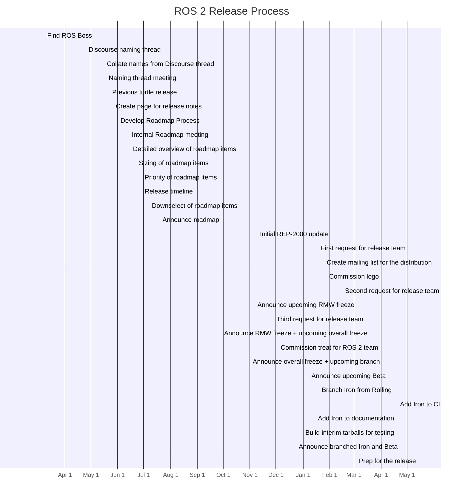

README
======

[License](./LICENSE)

<details>
  <summary>
    Some Details
  </summary>
  Here is some hidden text

  ```
  A code block
  ```
</details>


```mermaid
gantt
title ROS 2 Release Process
axisFormat %b %e

Find ROS Boss:                                    3/8/2022,  4/5/2022
Discourse naming thread:                          4/25/2022, 5/16/2022
Collate names from Discourse thread:              5/16/2022, 5/18/2022
Naming thread meeting:                            5/18/2022, 5/19/2022
Previous turtle release:                          5/22/2022, 5/23/2022
Create page for release notes:                    5/26/2022, 5/27/2022
Develop Roadmap Process:                          6/1/2022,  6/14/2022
Internal Roadmap meeting:                         6/14/2022, 6/15/2022
Detailed overview of roadmap items:               6/15/2022, 6/22/2022
Sizing of roadmap items:                          6/22/2022, 6/29/2022
Priority of roadmap items:                        6/29/2022, 7/6/2022
Release timeline:                                 6/29/2022, 6/30/2022
Downselect of roadmap items:                      7/7/2022,  7/8/2022
Announce roadmap:                                 7/19/2022, 7/21/2022
Initial REP-2000 update:                          11/9/2022, 11/18/2022
First request for release team:                   1/18/2023, 1/19/2023
Create mailing list for the distribution:         1/25/2023, 1/26/2023
Commission logo:                                  1/28/2023, 3/25/2023
Second request for release team:                  2/15/2023, 2/16/2023
Announce upcoming RMW freeze:                     3/5/2023,  3/6/2023
Third request for release team:                   3/15/2023, 3/16/2023
Announce RMW freeze + upcoming overall freeze:    3/20/2023, 3/21/2023
Commission treat for ROS 2 team:                  4/1/2023,  4/15/2023
Announce overall freeze + upcoming branch:        4/3/2023,  4/4/2023
Announce upcoming Beta:                           4/10/2023, 4/13/2023
Branch Iron from Rolling:                         4/17/2023, 4/21/2023
Add Iron to CI:                                   4/20/2023, 4/21/2023
Add Iron to documentation:                        4/20/2023, 4/21/2023
Build interim tarballs for testing:               4/20/2023, 4/21/2023
Announce branched Iron and Beta:                  4/24/2023, 4/26/2023
Prep for the release:                             5/15/2023, 5/19/2023
```